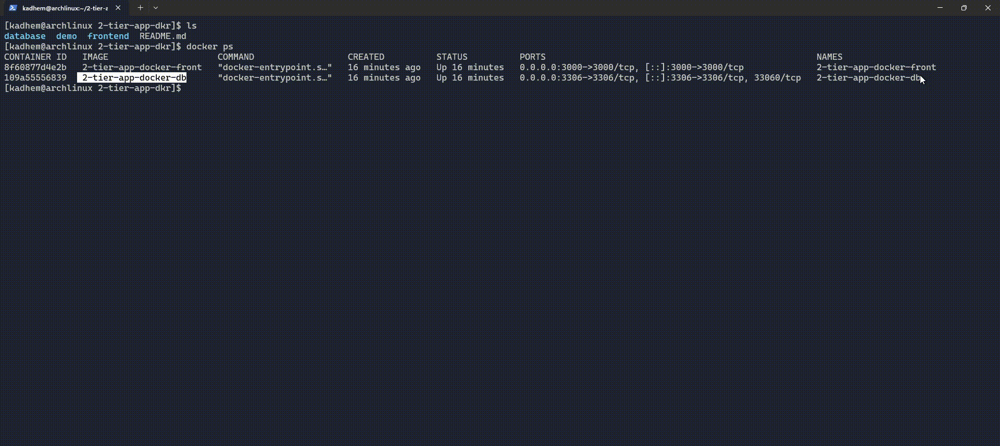

# TP Docker — Gestion de Contacts

**Statut :** Prototype Docker multi-conteneurs

---

## Table des matières
- [Objectif](#objectif)
- [Demo](#demo)
- [Structure du dépôt](#structure-du-depot)
- [Installation (rapide)](#installation-rapide)
- [Commandes utiles](#commandes-utiles)
- [Architecture (court)](#architecture-court)
- [Persistance](#persistance)
- [Dépendances & santé](#dependances--sante)
- [Fichier `docker-compose.yml` (extrait recommandé)](#fichier-docker-composeyml-extrait-recommande)
- [Conseils de partage](#conseils-de-partage)
- [Réponses aux questions du sujet (détaillées)](#reponses-aux-questions-du-sujet-detailles)

---

## Objectif

## Objectif
Déployer une application «gestion de contacts» en deux conteneurs (frontend + base de données) et fournir un ensemble reproductible pour tester localement.

---

## Demo


---

## Structure du dépôt
```
tp-docker-contacts/
├── frontend/
│   ├── Dockerfile
│   ├── server.js
│   ├── package.json
│   └── public/
│       ├── index.html
│       ├── app.js
│       └── style.css
├── database/
│   ├── Dockerfile
│   └── init.sql
├── docker-compose.yml
├── commandes.txt
└── screenshots/
    ├── 1_homepage.png
    ├── 2_add_contact.png
    └── 3_docker_ps.png
```

---

## Installation (rapide)
Prérequis : Docker et Docker Compose installés.

1. Cloner le dépôt :
```bash
git clone <url-du-repo>
cd tp-docker-contacts
```
2. Lancer avec Docker Compose :
```bash
docker-compose up --build
```
3. Ouvrir l'application :

Visitez `http://localhost:3000`.

---

## Commandes utiles

- Build manuel des images :
```bash
docker build -t contacts-db:1.0 ./database
docker build -t contacts-frontend:1.0 ./frontend
```
- Création réseau (si nécessaire) :
```bash
docker network create contacts-network
```
- Lancer DB (exemple) :
```bash
docker run -d --name contacts-db --network contacts-network -e MYSQL_ROOT_PASSWORD=rootpassword -e MYSQL_DATABASE=contacts_db -e MYSQL_USER=contacts_user -e MYSQL_PASSWORD=contacts_pass contacts-db:1.0
```
- Lancer frontend (exemple) :
```bash
docker run -d --name contacts-frontend --network contacts-network -e DB_HOST=contacts-db -e DB_USER=contacts_user -e DB_PASS=contacts_pass -e DB_NAME=contacts_db -p 3000:3000 contacts-frontend:1.0
```

---

## Architecture (court)
- **frontend** : Node.js / Express — sert les fichiers statiques et l'API `GET/POST /api/contacts`.
- **database** : MySQL — base `contacts_db` et table `contacts`.

---

## Persistance
Utiliser un volume Docker pour MySQL :

```yaml
volumes:
  contacts_db_data:
```

ou mappez un dossier hôte : `-v /chemin/hote/mysql:/var/lib/mysql`.

Remarque : si le volume existe, les scripts d'initialisation ne seront pas ré-exécutés.

---

## Dépendances & santé
- Avec `docker-compose`, utilisez `depends_on` + `healthcheck` pour s'assurer que la DB est prête avant le frontend.
- Alternativement, ajoutez un script `wait-for` dans l'image frontend pour retenter la connexion.

---

## Fichier `docker-compose.yml` (extrait recommandé)

```yaml
version: '3.8'
services:
  db:
    image: mysql:8.0
    environment:
      MYSQL_ROOT_PASSWORD: rootpassword
      MYSQL_DATABASE: contacts_db
      MYSQL_USER: contacts_user
      MYSQL_PASSWORD: contacts_pass
    volumes:
      - contacts_db_data:/var/lib/mysql
      - ./database/init.sql:/docker-entrypoint-initdb.d/init.sql:ro
    ports:
      - "3306:3306"
    healthcheck:
      test: ["CMD", "mysqladmin", "ping", "-h", "localhost"]
      interval: 5s
      timeout: 5s
      retries: 5

  frontend:
    build: ./frontend
    environment:
      DB_HOST: db
      DB_USER: contacts_user
      DB_PASS: contacts_pass
      DB_NAME: contacts_db
    ports:
      - "3000:3000"
    depends_on:
      db:
        condition: service_healthy

volumes:
  contacts_db_data:
```

---

## Conseils de partage
- Inclure `commandes.txt` listant les commandes exactes exécutées.
- Fournir un `.env.example` pour les variables sensibles.
- Documenter toute étape manuelle (ex. import de dump SQL, restauration de volume).


---

## Réponses aux questions du sujet (détaillées)

**1) Combien de commandes faut-il exécuter pour déployer l'application ?**

Minimum (build + run + vérifications) :

```text
1. docker build -t contacts-db:1.0 ./database
2. docker build -t contacts-frontend:1.0 ./frontend
3. docker network create contacts-network
4. docker run -d --name contacts-db --network contacts-network -e MYSQL_ROOT_PASSWORD=rootpassword -e MYSQL_DATABASE=contacts_db -e MYSQL_USER=contacts_user -e MYSQL_PASSWORD=contacts_pass contacts-db:1.0
5. docker run -d --name contacts-frontend --network contacts-network -e DB_HOST=contacts-db -e DB_USER=contacts_user -e DB_PASS=contacts_pass -e DB_NAME=contacts_db -p 3000:3000 contacts-frontend:1.0
6. docker ps
7. docker logs contacts-db
8. docker logs contacts-frontend
# + tests via curl / navigateur
```

Soit **~8 commandes principales** plus quelques vérifications.

**2) Que se passe-t-il si la machine redémarre ?**

- Par défaut, un conteneur lancé avec `docker run` **ne** redémarrera **pas** automatiquement après un reboot. Pour forcer le redémarrage, utilisez `--restart unless-stopped` ou définissez `restart:` dans `docker-compose.yml`.
- Lors d'un redémarrage manuel, démarrer d'abord la base de données, attendre sa disponibilité, puis démarrer le frontend.

**3) Ordre et dépendances de redémarrage**

- Ordre recommandé : `db` → attendre la disponibilité → `frontend`.
- Automatiser : dans `docker-compose` utilisez `depends_on` + `healthcheck`, ou intégrez un outil `wait-for` dans le frontend pour retenter la connexion.

**4) Gestion des dépendances entre conteneurs**

- `depends_on` contrôle l'ordre de lancement mais **ne garantit pas** la disponibilité réseau. Combinez `depends_on` avec un `healthcheck` sur la DB ou un script `wait-for` côté frontend.

**5) Partage du projet avec un collègue**

- Inclure : code complet, `Dockerfile`, `docker-compose.yml`, `commandes.txt`, `README.md`, `screenshots/` et un `.env.example`.
- Instructions claires : variables d'environnement à définir, commandes exactes, et note sur la persistance des volumes.

**6) Persistance : volumes et sauvegarde**

- Monter un volume Docker pour MySQL : `-v contacts_db_data:/var/lib/mysql`.
- Sauvegarde : `docker exec contacts-db mysqldump -u root -pPASSWORD contacts_db > dump.sql`.
- Remarque : si le volume existe déjà, `/docker-entrypoint-initdb.d` n'est pas ré-exécuté.

**7) Pourquoi `init.sql` peut ne pas s'appliquer ?**

- Les scripts dans `/docker-entrypoint-initdb.d` s'exécutent uniquement à la première initialisation de la base (quand le répertoire `/var/lib/mysql` est vide). Si un volume existe, le container démarre sans ré-appliquer ces scripts.

**8) Sécurité et bonnes pratiques rapides**

- Ne pas committer de mots de passe réels ; utiliser `.env` et `.env.example`.
- Restreindre l'exposition des ports en production (ne pas binder 3306 sur l'interface publique si inutile).
- Utiliser des comptes MySQL non-root pour l'application.

**9) Tests rapides pour valider le déploiement**

- Vérifier que le frontend répond : `curl http://localhost:3000/`.
- Tester l'API :
  - `curl http://localhost:3000/api/contacts` → doit retourner `[]` ou une liste.
  - `curl -X POST -H "Content-Type: application/json" --data '{"name":"Test","email":"t@e.com"}' http://localhost:3000/api/contacts`.
- Inspection DB : `docker exec -it contacts-db mysql -u contacts_user -pcontacts_pass -e "SELECT * FROM contacts_db.contacts;"`.